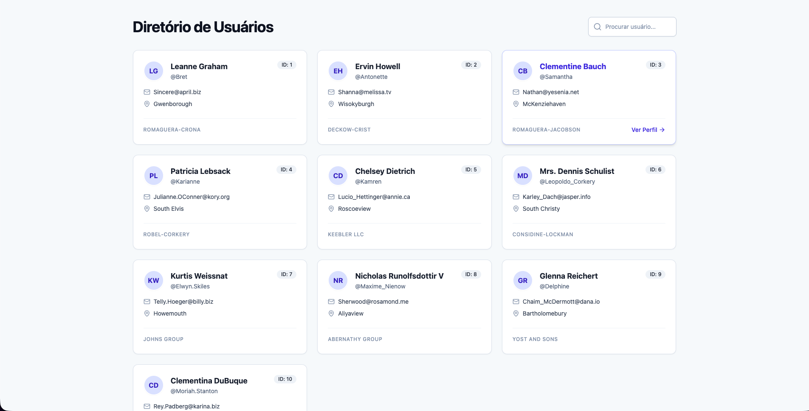

# User Dashboard – Teste Técnico Front-end Honda Motoca

Este projeto foi desenvolvido como parte do teste técnico para a vaga de Front-end Júnior. Trata-se de um dashboard responsivo para gerenciamento e visualização de usuários, consumindo a API pública JSONPlaceholder.

## Captura de tela



## Tecnologias Utilizadas

O projeto foi construído utilizando uma stack moderna e focada em performance:

- **React 18** (via Vite): Para uma construção rápida e otimizada.
- **TypeScript**: Para garantir tipagem estática e segurança no código.
- **Tailwind CSS**: Para estilização ágil, responsiva e consistente.
- **Axios**: Configurado com interceptors para gerenciamento de requisições HTTP.
- **React Router DOM**: Para gerenciamento de rotas e navegação SPA.
- **Lucide React**: Biblioteca de ícones leve e moderna.

## Funcionalidades

- **Listagem de Usuários:** Exibição de cards com informações essenciais.
- **Busca Inteligente:** Campo de pesquisa com estratégia de **Debounce** (atraso na execução) para evitar requisições desnecessárias a cada letra digitada.
- **Página de Detalhes:** Visualização completa do perfil do usuário e seus posts recentes.
- **Feedback Visual:** Indicadores de carregamento (Loading) e tratamento de erros amigável.
- **Design Responsivo:** Layout adaptável para dispositivos móveis e desktop.

## Estrutura e Organização (Arquitetura)

Busquei seguir princípios de **Clean Code** e separação de responsabilidades para manter o projeto escalável:

- `src/services`: Camada isolada para comunicação com a API.
- `src/hooks`: Lógica de estado e efeitos separada da interface (ex: `useUsers`, `useUserDetails`).
- `src/components/ui`: Componentes visuais genéricos (Botões, Inputs, Avatares).
- `src/components/users`: Componentes específicos do domínio de usuários.
- `src/types`: Interfaces TypeScript para garantir a consistência dos dados.

### Destaques Técnicos

1.  **Performance:** Na página de detalhes, utilizei `Promise.all` para buscar os dados do usuário e seus posts em paralelo, reduzindo o tempo de espera.
2.  **Organização:** A estrutura de pastas foi pensada para que qualquer desenvolvedor entenda o projeto rapidamente ("Screaming Architecture").

## Como Rodar o Projeto

Pré-requisitos: Node.js instalado.

1. Clone o repositório:

```bash
  git clone [https://github.com/WalyssonCavalcante/User-Dashboard.git](https://github.com/WalyssonCavalcante/User-Dashboard.git)
```

2. Entre na pasta do projeto:

```bash
cd user-dashboard
```

3. Instale as dependências:

```bash
npm install
```

4. Execute o servidor de desenvolvimento:

```bash
npm run dev
```

5. Acesse o localhost informado no seu navegador.

## Melhorias Futuras

Com mais tempo, eu gostaria de implementar:

- **Testes Unitários:** Aprender e Configurar Vitest e Testing Library para garantir a estabilidade dos componentes.
- **Paginação:** Implementar paginação na listagem principal (atualmente limitada pela API).
- **Filtros Avançados:** Adicionar filtros por cidade ou empresa.

Desenvolvido por **Wallysson Cavalcante**
